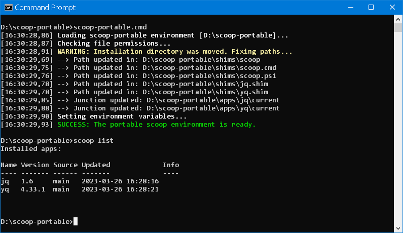
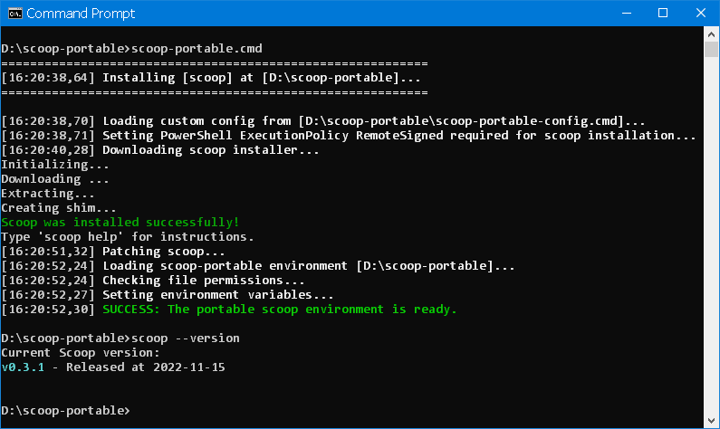

# scoop-portable

[](https://github.com/vegardit/scoop-portable/actions?query=workflow%3A%22Build%22)
[](#license)
[](CODE_OF_CONDUCT.md)

1. [What is it?](#what-is-it)
1. [License](#license)


## <a name="what-is-it"></a>What is it?

> **NOTE:** This project is _work-in-progress_, while it works fine with the apps we use, it may not yet work as expected with all apps installable via scoop. Pull requests are welcome!

**scoop-portable** is an attempt to provide a true portable, "non-invasive" environment of the [scoop](https://scoop.sh/) command-line installer for the Windows Command Prompt.

For ease of distribution/use, it is implemented as a single self-contained Windows batch file.

Advantages over using "regular" scoop:
- the scoop directory can be moved and live on an USB stick/external disk
- installing/removing/resetting apps does not require restarting the command prompt
- switching between different Java versions works seamlessly for the current and future sessions (https://github.com/ScoopInstaller/Java/wiki#switching-javas)
- when installing the git package, all GNU commands at `apps\git\usr\bin` are made available on PATH, i.e. no need to install additional packages like `coreutils`, `tar`, `vim`

Limitations:
- **scoop-portable** only works for the **Windows Command Prompt** and not for **PowerShell sessions**,
  however using **scoop-portable** together with [clink](https://github.com/chrisant996/clink) (also installable via scoop) gives a great command line experience and productivity.
- since the project strives for a purely portable environment, the following features/behaviours of **scoop** are disabled:
  - installation of global apps is disabled.
  - creation of start-menu entries.
  - permanent changes to the global PATH variable or setting of permanent environment variables by **scoop** is prevented.




## <a name="install"></a>Installation

1. Get a copy of the batch file using one of these ways:
   * Using old-school **Copy & Paste**:
      1. Create a local **empty** directory where scoop shall be installed, e.g. `C:\apps\scoop-portable`
      1. Download [scoop-portable.cmd](scoop-portable.cmd) file into that directory.
   * Using **Git**:
      1. Clone the project into a local directory, e.g.
         ```batch
         git clone https://github.com/vegardit/scoop-portable C:\apps\scoop-portable
         ```
1. (Optional) Customize the installation by creating a file called `scoop-portable-config.cmd` in the same directory.
    See [scoop-portable-config.example.cmd](scoop-portable-config.example.cmd) as an example.
1. Now execute `scoop-portable.cmd`.
   - On the first execution, scoop and the selected packages will be installed in a `scoop` sub-directory and the scoop environment is initialized.




## <a name="usage"></a>Usage

Once installed, subsequent executions of `scoop-portable.cmd` load scoop environment:
 - either in the current command window if executed from the command line, or
 - a new command window is opened if executed via Windows Explorer or e.g. a Desktop shortcut.

An app installed in the `scoop-portable.cmd` can be launched from anywhere using: `scoop-portable.cmd <app> [app args]`


## <a name="license"></a>License

All files are released under the [Apache License 2.0](LICENSE.txt).

Individual files contain the following tag instead of the full license text:
```
SPDX-License-Identifier: Apache-2.0
```

This enables machine processing of license information based on the SPDX License Identifiers that are available here: https://spdx.org/licenses/.
